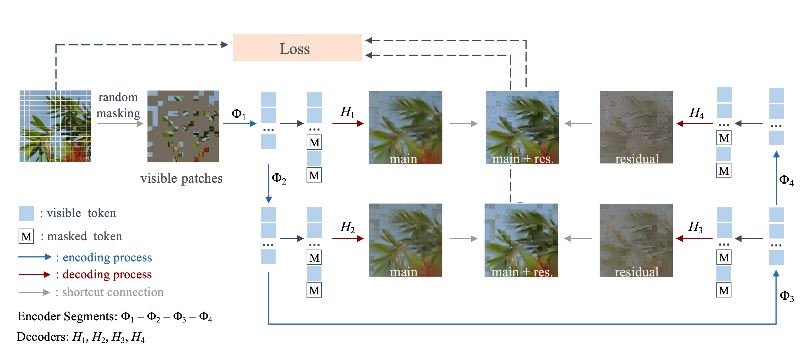

# [NeurIPS 2023] Masked Image Residual Learning for Scaling Deeper Vision Transformers
Official implementation of the paper [Masked Image Residual Learning for Scaling Deeper Vision Transformers](https://openreview.net/pdf?id=7WTA298wts)
> Abstract: Deeper Vision Transformers (ViTs) are more challenging to train. We expose a
degradation problem in deeper layers of ViT when using masked image modeling
(MIM) for pre-training. To ease the training of deeper ViTs, we introduce a self-supervised learning framework called Masked Image Residual Learning (MIRL),
which significantly alleviates the degradation problem, making scaling ViT along
depth a promising direction for performance upgrade. We reformulate the pretraining objective for deeper layers of ViT as learning to recover the residual of the
masked image. We provide extensive empirical evidence showing that deeper ViTs
can be effectively optimized using MIRL and easily gain accuracy from increased
depth. With the same level of computational complexity as ViT-Base and ViT-Large,
we instantiate 4.5× and 2× deeper ViTs, dubbed ViT-S-54 and ViT-B-48. The
deeper ViT-S-54, costing 3× less than ViT-Large, achieves performance on par with
ViT-Large. ViT-B-48 achieves 86.2% top-1 accuracy on ImageNet. On one hand,
deeper ViTs pre-trained with MIRL exhibit excellent generalization capabilities
on downstream tasks, such as object detection and semantic segmentation. On the
other hand, MIRL demonstrates high pre-training efficiency. With less pre-training
time, MIRL yields competitive performance compared to other approaches.

<div align='center'>

</div>


## Updates

***09/Nov/2023***

Upload the pre-trained and fine-tuned models.

***07/Oct/2023***

The preprint version is public at [arxiv](https://arxiv.org/abs/2309.14136).


## Pretrain on ImageNet-1K
The following table provides pretrained checkpoints and logs used in the paper.
| model | pre-trained 300 epochs | pre-trained 800 epochs  |
| :---: | :---: | :---: |
| ViT-B-48 | [checkpoint](https://pan.baidu.com/s/1H3gpMl4-S0gFibv5xbJDHQ?pwd=mirl)/[log](https://pan.baidu.com/s/1ZmW1KyrzLBvD52buX1GqAQ?pwd=mirl)| [checkpoint](https://pan.baidu.com/share/init?surl=bpyLctZy6Ww2QQ-s9KiSjQ&pwd=mirl)/[log](https://pan.baidu.com/s/1XKBXSLbyPqeXFREaTdmupQ?pwd=mirl)|
| ViT-S-54 | [checkpoint](https://pan.baidu.com/s/12CxU36H6a6oObMllwX7izQ?pwd=mirl)/[log](https://pan.baidu.com/s/1IwvQYMjhyGCLXpDFfHXjww?pwd=mirl)| [checkpoint](https://pan.baidu.com/share/init?surl=oF0Gnhhlx6gdgUhIjjDl6Q&pwd=mirl)/log |
ViT-B-24| [checkpoint](https://pan.baidu.com/s/1BLywX8vam47FWMO1zsVxFA?pwd=mirl)/[log](https://pan.baidu.com/s/1yO-ZpjuFZ5erLq-Gy3sTZw?pwd=mirl) | -

We also converted the Paddle checkpoint of ViT-B-48 pre-trained 800 epochs into a PyTorch version ([download link](https://pan.baidu.com/s/1u3Kv1ENTRi3oD-usRkHQSA?pwd=mirl 
)) using script convert_pd2pth.py

## Main Results on ImageNet-1K
| Encoder | Method | Pre-train Epochs | FT acc@1(%) | FT checkpoint/log |
| :---: | :---: | :---: | :---: | :---: |
| ViT-B | BEiT | 800 | 83.2 | - |
| ViT-B | MAE | 1600 | 83.6 | - |
| ViT-B | MIRL | 300/800 | 83.5/84.1 | [checkpoint](https://pan.baidu.com/s/1chhS8_D5EDlHgE07ohOVtw?pwd=mirl)/[log](https://pan.baidu.com/s/15qs-OsoAE_ZVPCZPhChi4g?pwd=mirl) |
| ViT-S-54 | MIRL | 300/800 | 84.4/84.8 | [checkpoint](https://pan.baidu.com/s/1THSNteL07zLSnSLgDm2z8A?pwd=mirl)/[log](https://pan.baidu.com/s/1CZ4ZX5Ja-OYNY8NwWD2mgA?pwd=mirl) |
| ViT-B-24 | MIRL | 300 | 84.4/84.7 | [checkpoint](https://pan.baidu.com/s/1znSpIMcYpH7HCsxr-Cf86A?pwd=mirl)/[log](https://pan.baidu.com/s/1duG4gz3mj64TmNqThXWZvA?pwd=mirl) |
| ViT-L | MaskFeat | 1600 | 85.7 | - |
| ViT-L | HPM | 800 | 85.8 | - |
| ViT-L | MAE | 1600 | 85.9 | - |
| ViT-B-48 | MIRL | 300/800 | 85.3/86.2 | [checkpoint](https://pan.baidu.com/s/1upUTIkGgWGQQFR1y7hLT4A?pwd=mirl)/[log](https://pan.baidu.com/s/1yiKqt7SCQI1LhjKr4QhoFA?pwd=mirl) |

## Acknowledgement
Our project is based on [MAE](https://github.com/facebookresearch/mae). Thanks for their wonderful work.


## Citation

```bash
@article{huang2023masked,
  title={Masked Image Residual Learning for Scaling Deeper Vision Transformers},
  author={Huang, Guoxi and Fu, Hongtao and Bors, Adrian G},
  journal={arXiv preprint arXiv:2309.14136},
  year={2023}
}
```
